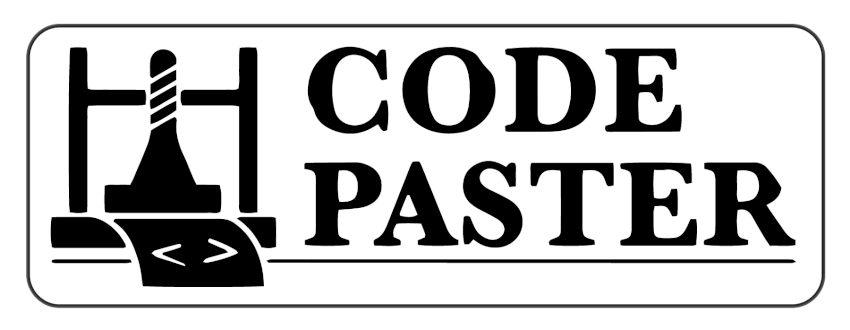

<!-- PROJECT SHIELDS -->
<!--
*** I'm using markdown "reference style" links for readability.
*** Reference links are enclosed in brackets [ ] instead of parentheses ( ).
*** See the bottom of this document for the declaration of the reference variables
*** for contributors-url, forks-url, etc. This is an optional, concise syntax you may use.
*** https://www.markdownguide.org/basic-syntax/#reference-style-links
-->

[![Contributors][contributors-shield]][contributors-url]
[![Forks][forks-shield]][forks-url]
[![Stargazers][stars-shield]][stars-url]
[![Issues][issues-shield]][issues-url]
[![MIT License][license-shield]][license-url]

<!-- PROJECT LOGO -->
 

  
  

    Code Paster is a Teacher-to-Student communication tool for online programming lessons. Create a new session and easily share your code with all students connected so they can follow along with your examples.
  

 

<!-- TABLE OF CONTENTS -->

## Table of Contents

- [About the Project](#about-the-project)
  - [Built With](#built-with)
- [Roadmap](#roadmap)
- [License](#license)

<!-- ABOUT THE PROJECT -->

## About The Project

During your programming online lessons you will write hundreds of lines of code and dozens of snippets. For students following along with the code there's nothing more annoying than falling behind the explanation because of a small typo or a missed variable. With Code Paster you can simply copy your code examples and share it in real time with your classroom.

This project was developed by Lemoncode Frontend Master students:

<!-- Include collaborators -->

### Built With

- [React](https://github.com/facebook/react/)
- [Material-UI](https://material-ui.com/)
- [Socket.io](https://socket.io/)

<!-- ROADMAP -->

## Roadmap

See the [open issues](https://github.com/Lemoncode/code-paster/issues) for a list of proposed features (and known issues).

<!-- LICENSE -->

## License

Distributed under the MIT License. See `LICENSE` for more information.

<!-- MARKDOWN LINKS & IMAGES -->
<!-- https://www.markdownguide.org/basic-syntax/#reference-style-links -->

[contributors-shield]: https://img.shields.io/github/contributors/Lemoncode/code-paster.svg?style=flat-square
[contributors-url]: https://github.com/Lemoncode/code-paster/graphs/contributors
[forks-shield]: https://img.shields.io/github/forks/Lemoncode/code-paster.svg?style=flat-square
[forks-url]: https://github.com/Lemoncode/code-paster/network/members
[stars-shield]: https://img.shields.io/github/stars/Lemoncode/code-paster.svg?style=flat-square
[stars-url]: https://github.com/Lemoncode/code-paster/stargazers
[issues-shield]: https://img.shields.io/github/issues/Lemoncode/code-paster.svg?style=flat-square
[issues-url]: https://github.com/Lemoncode/code-paster/issues
[license-shield]: https://img.shields.io/github/license/Lemoncode/code-paster.svg?style=flat-square
[license-url]: https://github.com/Lemoncode/code-paster/blob/master/LICENSE.txt
